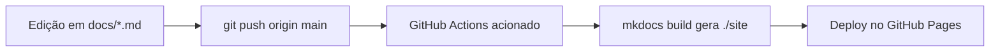

# 🚀 Deploy Automatizado no GitHub Pages

A publicação da documentação oficial do projeto é feita de forma contínua e 100% automatizada através do **GitHub Actions**.

---

## ⚙️ Como Funciona o Pipeline

Toda vez que você realiza um `git push` para a branch `main`, o GitHub Actions executa o fluxo configurado em `.github/workflows/docs.yml`:



---

## 🛠️ Como Ativar no Seu Repositório

Siga estes 3 passos simples para habilitar a visualização da documentação pública no seu repositório:

### 1. Configurar as Permissões do GitHub Pages
1. Acesse o seu repositório no GitHub:
   ```
   https://github.com/alliciarocha/proj-exten
   ```
2. No menu superior, clique na aba **Settings** (Configurações).
3. Na barra lateral esquerda, clique na seção **Pages**.
4. Sob o cabeçalho **Build and deployment**:
   - No campo **Source**, selecione `GitHub Actions`.
5. O GitHub confirmará automaticamente que a ação de deploy está ativa.

---

### 2. Verificar o Fluxo de Trabalho
O repositório já conta com o arquivo `.github/workflows/docs.yml` (e seu equivalente `deploy.yml`) pré-configurado com as permissões corretas:
```yaml
permissions:
  contents: read
  pages: write
  id-token: write
```

---

### 3. Acompanhar e Acessar
Sempre que um push for concluído:
1. Vá até a aba **Actions** no seu repositório GitHub.
2. Você verá o workflow *"Deploy MkDocs to GitHub Pages"* rodando. Em cerca de 1 a 2 minutos ele será concluído com um ícone de sucesso (✅).
3. A sua documentação estará no ar no endereço oficial:
   ```
   https://alliciarocha.github.io/proj-exten/
   ```
