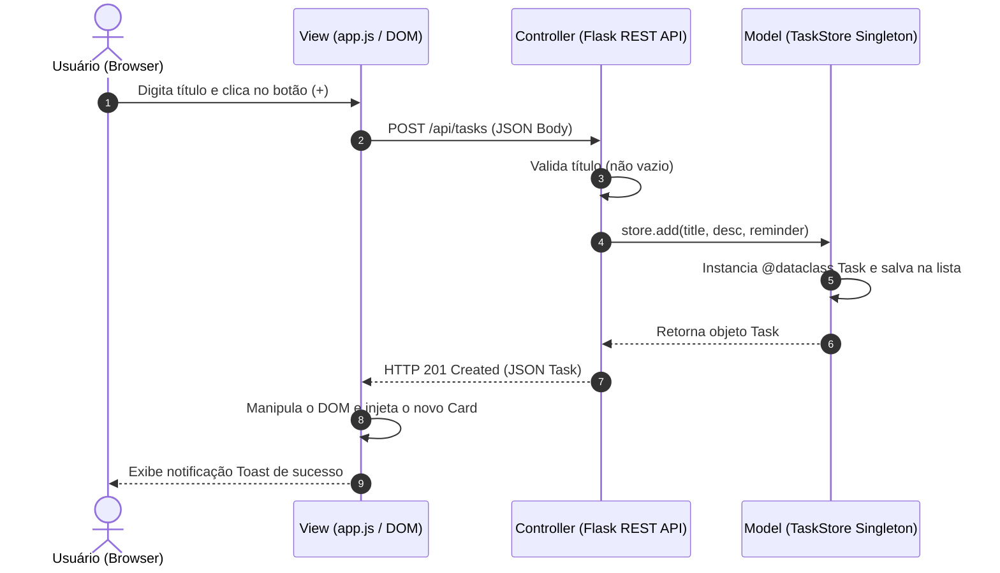

# 🏗️ Arquitetura MVC e Fluxo de Dados

O **Todo List** foi rigorosamente arquitetado sob o padrão **Model-View-Controller (MVC)**, garantindo um código limpo, testável, modular e com clara separação de responsabilidades.

---

## 🗺️ Diagrama de Componentes e Interação

---

## 🗂️ Detalhamento das Camadas

### 1. Camada Model (`scr/model/`)
Responsável pelas regras de negócio, integridade dos dados e estado da aplicação em memória.
- **`Task` (@dataclass)**: Estrutura de dados contendo `id`, `title`, `description`, `done` (booleano), `reminder` (datetime opcional) e `created_at`. Implementa o método `to_dict()` para facilitar a conversão para JSON.
- **`TaskStore` (Singleton)**: Garante uma instância única em toda a execução do servidor, gerenciando o array de tarefas (`_tasks`) e o auto-incremento de IDs (`_next_id`). Oferece métodos robustos e tipados para CRUD e contadores dinâmicos (`count_done` e `count_pending`).

### 2. Camada Controller (`scr/controller/`)
Intermedeia as requisições HTTP enviadas pelo cliente e aciona o Model correspondente.
- **Blueprint Flask (`/api/tasks`)**: Roteador RESTful limpo e isolado.
- **Validação de Entrada**: Intercepta corpos de requisição e barra dados inválidos (como strings vazias para títulos) retornando códigos HTTP padronizados (`400 Bad Request`, `404 Not Found`, etc.).

### 3. Camada View (`scr/view/`)
A interface gráfica de interação direta com o usuário final.
- **HTML5 Estrutural (`index.html`)**: Layout semântico com tags como `<nav>`, `<main>`, `<aside>` e `<header>`. Contém modais e containers para notificações.
- **Estilização em CSS Puro (`style.css`)**: Utilização de Custom Properties (Design Tokens) para cores, espaçamentos, sombras e animações de alta fidelidade ao Figma.
- **JavaScript Modular (`app.js`)**: Gerencia eventos assíncronos (`addEventListener`), efetua requisições HTTP via `Fetch API` e atualiza a interface de forma reativa através de manipulação direta do DOM.
