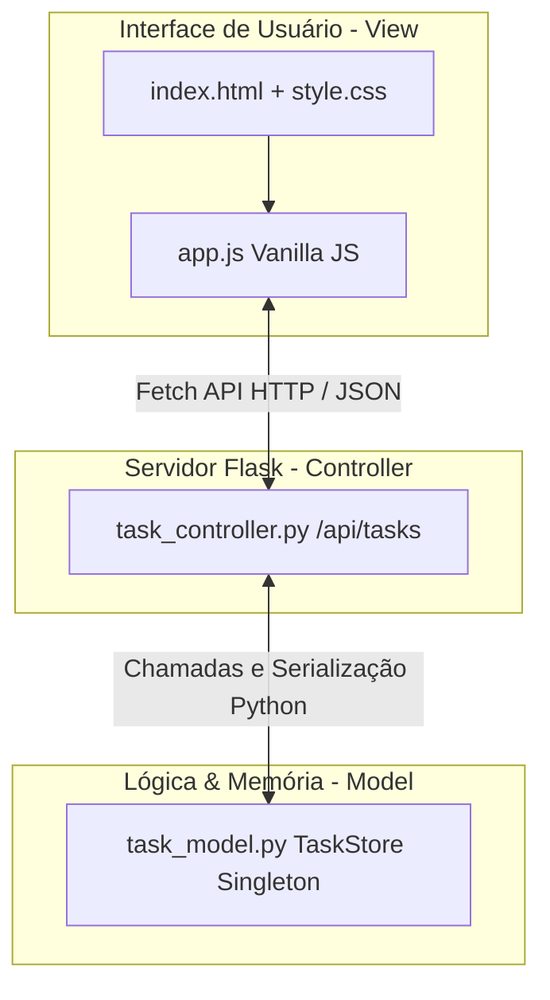

# 🏠 Home — Todo List Gerenciador de Tarefas

Seja bem-vindo à documentação oficial do **Todo List**, uma aplicação web completa, moderna e responsiva construída em Python (Flask) e JavaScript Vanilla, guiada por rigorosas práticas de **Specification-Driven Development (SDD)** e arquitetura **MVC**.

---

## ✨ Características Principais

- 🎯 **Gerenciamento Completo de Tarefas**: Crie, edite, conclua e exclua tarefas em tempo real.
- ⏰ **Sistema de Lembretes Agendados**: Defina datas e horários exatos para suas entregas com suporte nativo a `datetime-local`.
- 🎨 **Design System "Soft UI" Premium**: Interface visualmente deslumbrante, paleta azul premium (tons frios e modernos).
- 🔍 **Busca Dinâmica e Filtros Rápidos**: Alterne instantaneamente entre tarefas *Todas*, *Pendentes* e *Concluídas*, ou busque por termos específicos sem recarregar a página.
- 📅 **Mini Calendário Interativo**: Navegue entre meses na barra lateral e acompanhe o dia atual em destaque.
- 📊 **Estatísticas em Tempo Real**: Contadores de produtividade atualizados instantaneamente.
- 🚀 **Pronto para Nuvem**: Configurado para deploy contínuo e automatizado via GitHub Actions e Vercel.

---

## 🏗️ Visão Geral da Arquitetura MVC

---

## 🛠️ Stack Tecnológico

| Camada | Tecnologia | Descrição |
| :--- | :--- | :--- |
| **Backend** | Python 3.10+ & Flask | Servidor leve, roteamento de API RESTful robusto |
| **Frontend** | HTML5 / Vanilla CSS / JS | Estrutura semântica, Custom Tokens e requisições assíncronas |
| **Design** | Figma / Soft UI | UI moderna com ícones Lucide e tipografia Google Fonts (Outfit e Plus Jakarta Sans) |
| **Doc** | MkDocs & Material Theme | Gerador estático com suporte a busca, abas e dark mode |
| **CI/CD** | GitHub Actions / Pages | Pipeline de integração e deploy automatizado |

---

## 📌 Links Úteis

- 🚀 [Comece Agora: Início Rápido](quickstart.md)
- 📖 [Documentação da API REST](documentation/api.md)
- 📋 [Especificação SDD do Projeto](documentation/specification.md)
- ❓ [Perguntas Frequentes (FAQ)](faq.md)
